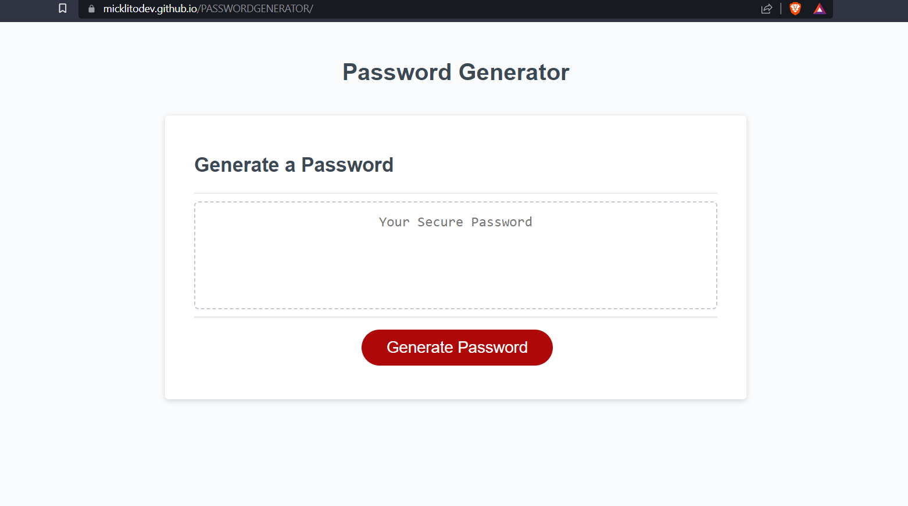

# PASSWORDGENERATOR

## Link

Click [here](https://micklitodev.github.io/PASSWORDGENERATOR/) to go to the live link.

## ScreenShot

## Description

Please read each section to better understanding of the idea behind this project.

- Why did you build this project? To Better display my skills and assets as a software developer to hiring jobs and companies.
- What problem does it solve? This application can be used to Generate a random password that meets
specific criteria so that its viable in most settings. 

## Usage

To use this application, Upon loading into the page you should be greeted with a prompt. However if you are not. Please click the Generate Password button. Upon seeing the initial prompt please follow through carefully reading each individual prompt and responding to them as described in the prompt information. NOTE: Responses must follow lower case format or they will prompt you to enter the value in again. After finishing the prompt you will be displayed with password from selected criteria. You may copy and paste this or if you are unsatisfied run it again with diffrent criteria. 

Thank you! 

## Credits

-Michael Lito

## License

none

---